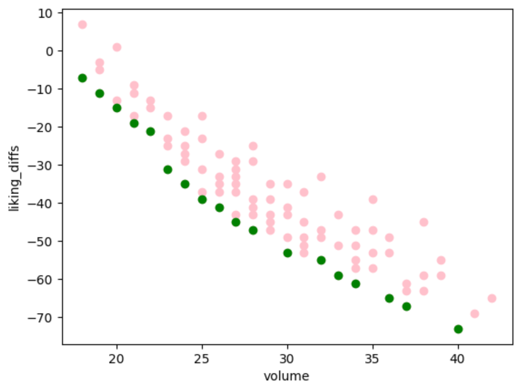

# Multi-Objective Optimization & Decision Making: A Worked Trip-Packing Example 👕👖

This project demonstrates multi-objective optimization (MOO) and
multi-criteria decision making (MCDM) using a realistic suitcase-packing
problem, combining classical algorithms with an LLM-powered explainer.

The project combines:
- Exhaustive ground-truth Pareto analysis and theory explanation
- Multiple evolutionary multi-objective algorithms
- Post-Pareto decision-making techniques
- A LangChain-based RAG chatbot that explains results and guides users

## 🧳 Get out your suitcase!
We imagine a case where we've picked 20 items of clothing for our trip, just barely squeezing into our 
luggage. We don't want to risk that pesky $35 checked bagged fee after buying souvenirs, but we also still
want to have lots of different outfits to chose from. And if we're discarding any items, we'd still like to
keep our favorites if possible. We now have three objectives to balance:
- Minimize suitcase volume
- Maximize number of possible outfits
- Maximize how much we like the items we've brought
   
This situation is an everyday day conundrum as opposed to an industry-specific one,
and the objectives conflict in intuitive ways, and aren, making the problem ideal for:
- Demonstrating Pareto optimality
- Comparing algorithm behavior
- Applying decision-making methods
- Explaining results to non-experts
  
The decision variables are binary (include or exclude clothing items), making this a discrete, combinatorial MOO problem.

## What this repository contains
This project demonstrates knowledge and 
shows application of the full MOO/MCDM process from initial problem context 
to final solution(s):
### Part 1 (Problem Introduction)
Introduction to Pareto theory: explaination of concepts like dominence, optimality, the Pareto front  
Ground-truth solution space: Because the problem size is manageable, all possible solutions are enumerated.
This allows us to compute the true Pareto front and use it as a reference when evaluating algorithms.  
2D Representation of the full solution space w/ the true Pareto front 
(split across three plots due to 3 objectives -> 2 dimensions, 3D Plotly plots in notebook):  


### Part 2 (MOO Algorithms)
Explanation of why algorithms are necessary for complex MOO problems, and the principles of evolutioary programming.  
Several algorithms are implemented and compared, including:  
- NSGA-II
- SPEA2
- MOEA/D
- SMS-EMOA
    
These are used to approximate the Pareto front and analyze how different algorithmic biases affect results.
We want to approximate as much of the true Pareto front as possible, as fast as possible, and 
comparison involves visual inspection of solution space:  
  
  
and numerical metrics:  
  
### Part 3 (Decision-making methods (MCDM))
After generating Pareto-optimal solutions, multiple decision-making approaches are applied to select a final solution, including:
- Weighted sum methods
- TOPSIS
- Knee-point selection
  
This reflects how MOO is used in practice: optimize first, decide later.  
When applicable, visuals showing how the method selects its point are displayed, like for example the Epsilon Constraint method.    
First you constrain one objective, e.g. saying any solution where you lose a max of 40 outfits:  
  
We can now treat this as a two objective problem:  
  
Then we can set a second constraint, like a max volume of 20, and since 3-2 = 1 we only have one solution remaining:  
  

### Part 4 (LLM-powered explainer chatbot):
A LangChain RAG chatbot is included that:
- Reads the project notebooks and reference material
- Answers conceptual questions about MOO/MCDM
- Explains why different algorithms behave differently
- Helps users decide what method to use for their own problems
utilizing the Qwen3-32b model through Groq and the nomic-embed-text model with Ollama for the embeddings.
  
The chatbot indexes:
- Project notebooks
- A conceptual MOO/MCDM reference
- External decision-making resources
  
For example:
```
================================ Human Message =================================

Why did MOPSO-CD underperform in our suitcase example problem? In what circumstance would MOPSO-CD outperform other algorithms?

================================== Ai Message ==================================
Tool Calls:
  retrieve_context (79e4c4dha)
 Call ID: 79e4c4dha
  Args:
    query: MOPSO-CD suitcase problem performance comparison
================================= Tool Message =================================
Name: retrieve_context

================================== Ai Message ==================================

The underperformance of **MOPSO-CD** in the suitcase example problem likely stems from its reliance on **crowding distance** to maintain diversity in the Pareto front. If the suitcase problem involves **highly constrained or discontinuous objective spaces** (e.g., strict capacity limits, non-linear trade-offs between objectives), MOPSO-CD's crowding distance metric may struggle to balance exploration and exploitation effectively. Additionally, if the problem's optimal solutions cluster in narrow regions of the search space, the **lack of adaptive mutation** in MOPSO-CD could hinder its ability to refine solutions in those areas.

---

### When MOPSO-CD Might Outperform Others:
1. **Diverse Pareto Fronts**: Problems requiring a **spread-out set of solutions** (e.g., multi-mode optimization) where crowding distance ensures good coverage.
2. **Low-Dimensional, Smooth Landscapes**: When objectives are **moderately conflicting** and the search space is not dominated by local optima.
3. **Computationally Lightweight Needs**: If rapid convergence to a near-optimal set is prioritized over fine-grained precision (e.g., preliminary design exploration).
4. **Problems with Connected Pareto Fronts**: Where the true Pareto front is continuous and convex, allowing crowding distance to effectively preserve diversity.

---

### Recommendations:
- For the suitcase problem, consider hybridizing MOPSO-CD with **local search operators** or adjusting its **mutation rate** to better handle constraints.
- Compare with **NSGA-II** (if non-dominated sorting suits the problem) or **MOEA/D** (for decomposition-based handling of complex trade-offs).

Let me know if you'd like deeper analysis on specific algorithm mechanics!
```

# This project demonstrates
- Pareto optimality and tradeoffs
- Differences between MOO and MCDM
- Algorithmic bias in MOEAs
- Post-Pareto decision making
- Hybrid optimization + decision workflows
- Explainability using LLMs
  
as well as my ability to apply these concepts and relay them to a non-technical audience.
